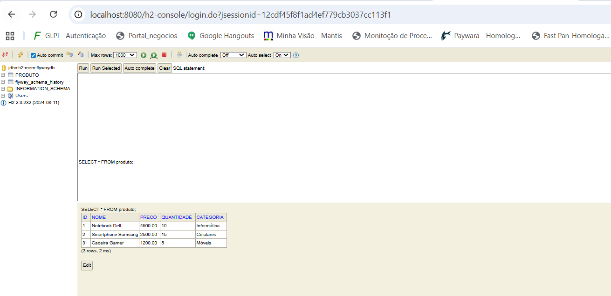
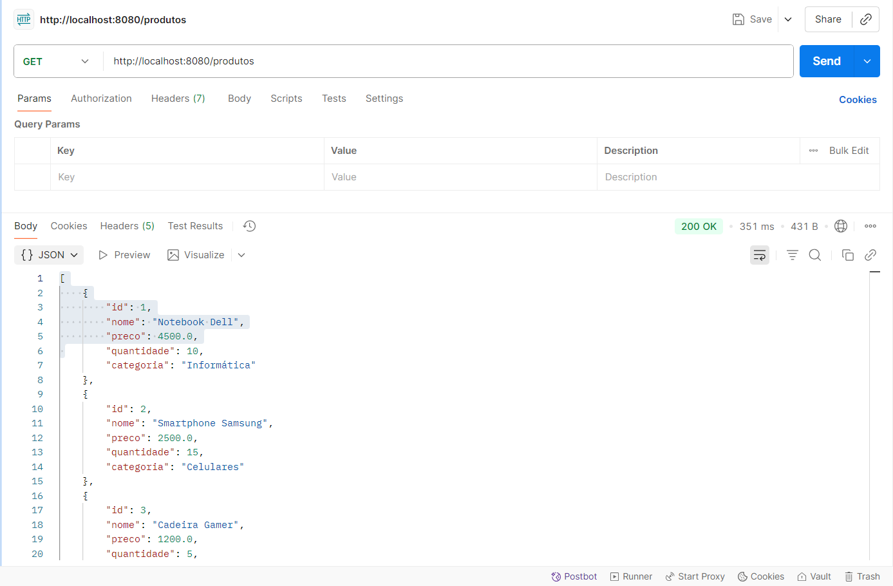

<div align="center">

# 📦 Flyway Demo - Projeto Spring Boot com H2  

</div>

---

## 📖 Objetivo da Atividade
Implementar um sistema de **controle de versão de banco de dados** usando **Flyway** em uma aplicação **Spring Boot**, criando e gerenciando migrações para a entidade **Produto**.

---

## 📝 Descrição
Este projeto consiste em um **sistema de cadastro de produtos** para uma loja virtual, desenvolvido com **Spring Boot** e **Flyway**.  
O objetivo é garantir que todas as alterações no **schema do banco de dados** sejam versionadas e aplicadas de forma consistente em diferentes ambientes (desenvolvimento, teste e produção).
---

## ⚙️ Tecnologias Utilizadas
- Java 21 (JDK 21.0.1)  
- Spring Boot 3.5.6  
- Spring Web  
- Spring Data JPA  
- H2 Database  
- Flyway  
- Maven  

---

## 🗂️ Estrutura do Projeto

```
src/
├── main/
│   ├── java/com/example/flywaydemo/
│   │   ├── FlywayDemoApplication.java
│   │   ├── config/DatabaseConfig.java
│   │   ├── model/Produto.java
│   │   ├── repository/ProdutoRepository.java
│   │   └── controller/ProdutoController.java
│   └── resources/
│       ├── application.properties
│       └── db/migration/
│           ├── V1__Create_products_table.sql
│           ├── V2__Add_category_to_products.sql
│           └── V3__Insert_initial_products.sql
```

---

## 🚀 Como rodar o projeto

Clone o repositório:

```bash
git clone https://github.com/leomotalima/flywaydemo.git
cd flywaydemo
```

Rodar com Maven:

```bash
./mvnw spring-boot:run
```

Ou abrir o projeto na sua IDE (IntelliJ / Eclipse) e rodar a classe:

```
com.example.flywaydemo.FlywaydemoApplication
```

Após iniciar, acesse:

- **API REST**: [http://localhost:8080/produtos](http://localhost:8080/produtos)  
- **Console H2**: [http://localhost:8080/h2-console](http://localhost:8080/h2-console)  
  - JDBC URL: `jdbc:h2:mem:flywaydb`  
  - Usuário: `sa`  
  - Senha: *(em branco)*  

---

## 🌱 Migrações Flyway

- `V1__Create_products_table.sql`: Cria tabela `produto`  
- `V2__Add_category_to_products.sql`: Adiciona coluna `categoria`  
- `V3__Insert_initial_products.sql`: Insere dados iniciais  

---

## 🔗 Endpoints da API

- **GET** `/produtos` → Lista todos os produtos  
- **GET** `/produtos/{id}` → Busca produto por ID  
- **POST** `/produtos` → Cria novo produto  
- **PUT** `/produtos/{id}` → Atualiza produto existente  
- **DELETE** `/produtos/{id}` → Remove produto  

---

## 📸 Prints de Funcionamento

### Console H2


### GET /produtos


---

## 👨‍🎓 Integrante:
- **Léo Mota Lima (RM 557851)**  
Disciplina **Java Advanced** - Turma: 2TDSB - Ano: 2025 🚀
